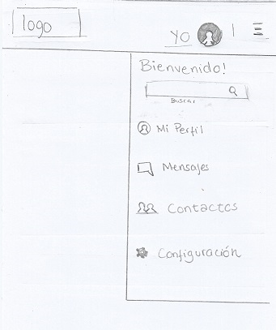
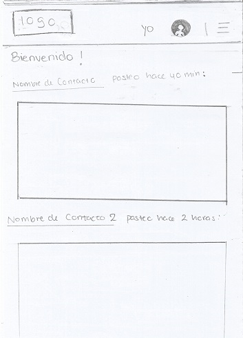

## Proyecto Red Social

### Miembros
- De la Cruz Lozano Pamela
- Herrera Polo Romina Valeria
- Ramírez Navarro Lidia María

### Sobre nuestro proyecto
Aplicación móvil y web de propuesta de red social

### Fases del desarrollo
1. Investigación
2. Planificación
 
3. Identificar, analizar, diseñar, construir y hacer pruebas

 
 

### Tecnologias usadas
- HTML5
- CSS3
- JQUERY

### Sketching
##### Registro

##### Login

##### Implementando Perfil de Usuario

##### Menú Hamburguesa Desplegado

##### Newsfeed

##### Mi Perfil

##### Contactos

